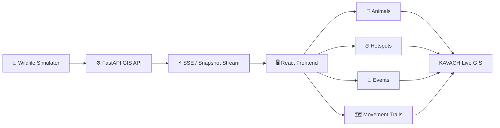
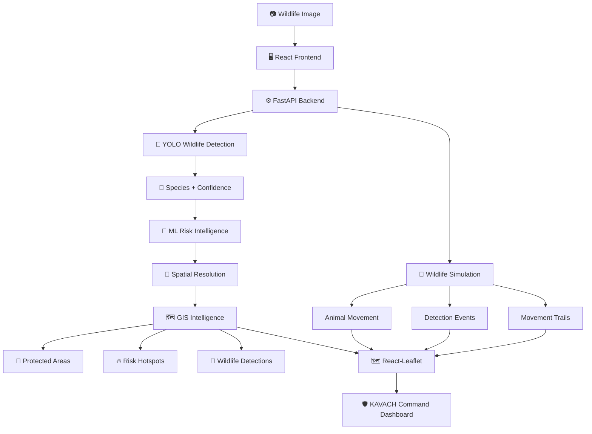
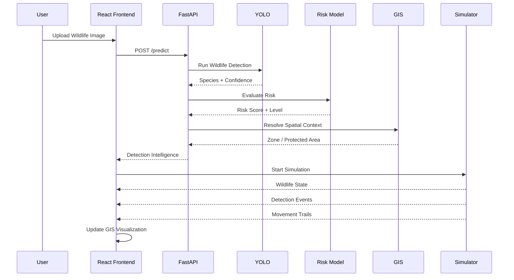
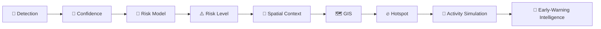
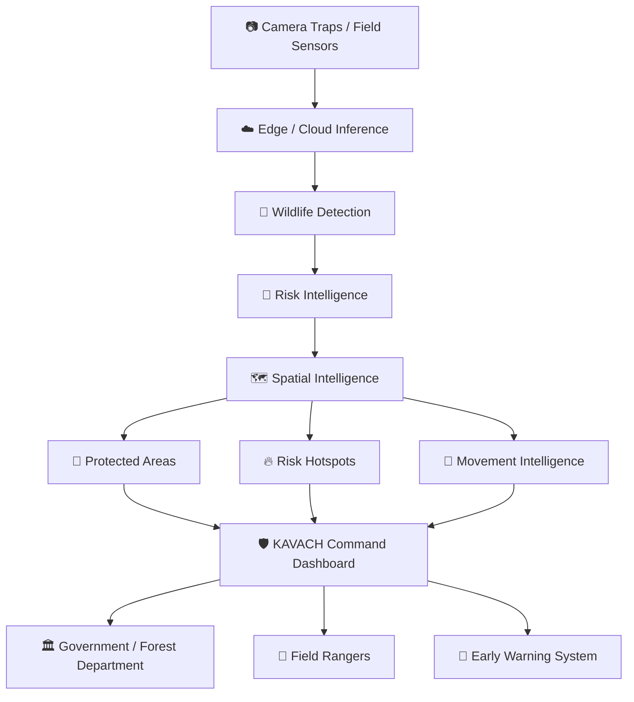

# 🛡️ KAVACH

## AI-Powered Wildlife Conflict Intelligence & Early Warning System

> **Detect wildlife. Assess risk. Understand the landscape. Respond earlier.**

<p align="center">
  🐘 <b>KAVACH — Wildlife Intelligence & Early Warning Platform</b>
  <br/><br/>
  <sub>From AI wildlife detection to spatial risk intelligence and real-time simulation.</sub>
</p>

<p align="center">
  
  
  
  
  
  
</p>

---
# 🏆 Hackathon Achievement

## 🥈 INFINITY HACKS 2026 — HACKERRANK

**WINNER: RUNNER-UP**

**Track:** 🐾 Wildlife Protection

# 🚨 The Problem

Human-wildlife conflict is not simply a wildlife detection problem.

A camera-trap image can tell us that an animal was detected, but a useful early-warning system needs to answer much more:

- 🐾 What species was detected?
- 🎯 How confident is the detection?
- 📍 Where did the detection occur?
- ⚠️ What level of risk does the observation represent?
- 🗺️ Which zone or protected area is involved?
- 🔥 Are detections forming an emerging hotspot?
- 🐘 How is wildlife activity changing over time?
- 🚨 Where should attention be prioritized?

Wildlife observations, geographic information and risk indicators can exist as disconnected pieces of information.

This makes it difficult to move from **observation** to **actionable intelligence**.

KAVACH addresses this gap by connecting AI detection, ML-based risk intelligence, GIS and real-time wildlife simulation into one operational platform.

---

# 💡 Our Solution

**KAVACH** is an AI-powered wildlife conflict intelligence and early-warning platform that combines:

- 🐾 Computer Vision
- 🧠 Machine Learning
- 🗺️ GIS
- 🔥 Risk Intelligence
- 🐘 Wildlife Simulation
- ⚡ Real-Time Event Streaming
- 📊 Interactive Command Dashboard

The complete intelligence pipeline is:

```text
Wildlife Image
      ↓
AI Wildlife Detection
      ↓
Species + Confidence
      ↓
ML Risk Intelligence
      ↓
Spatial Context
      ↓
Protected Area / Zone
      ↓
Risk Hotspot
      ↓
GIS Visualization
      ↓
Early-Warning Intelligence
```

---

# 🧠 Core Principle

> **Detect first. Understand the risk. Add spatial context. Observe how the situation evolves.**

KAVACH connects the different stages of the intelligence pipeline instead of treating the ML prediction as the final output.

| Layer | Responsibility |
|---|---|
| 🐾 Computer Vision | Detect wildlife from imagery |
| 🧠 ML Layer | Generate risk intelligence |
| 🗺️ GIS Layer | Add geographic context |
| 🐘 Simulation Layer | Demonstrate evolving wildlife activity |
| ⚡ Real-Time Layer | Stream changing events |
| 📊 Command Center | Present intelligence to operators |

The result is a connected wildlife intelligence workflow.

---

# 🤖 AI Wildlife Detection

KAVACH accepts wildlife imagery through the dashboard and processes it through a trained YOLO-based detection pipeline.

The backend exposes the prediction service through FastAPI.

```text
📷 Wildlife Image
        ↓
⚙️ FastAPI /predict
        ↓
🧠 YOLO Model
        ↓
🐾 Wildlife Detection
        ↓
🎯 Species + Confidence
        ↓
🧠 Risk Intelligence
```

The repository includes trained model weights used by the inference pipeline.

### Detection Output

The system surfaces:

- Wildlife species
- Detection confidence
- Detection timestamp
- Associated zone
- Detection history

The resulting detection becomes the input for the downstream risk and spatial intelligence layers.

---

# 🧠 ML Risk Intelligence

Wildlife presence alone does not describe the complete conflict context.

KAVACH includes a separate ML risk layer that evaluates detection-related information and produces risk intelligence.

Risk is represented through:

```text
🟢 LOW
🟡 MEDIUM
🔴 HIGH
```

This allows the system to move from:

> **"An animal was detected."**

to:

> **"This detection contributes to a measurable wildlife-conflict risk signal."**

The repository contains the trained risk model used by the backend.

---

# 🗺️ GIS Intelligence

KAVACH connects wildlife intelligence with geographic context.

The GIS layer supports:

- Protected areas
- Wildlife detections
- Zones
- Risk hotspots
- Species filtering
- Risk filtering
- Wildlife trails
- Spatial visualization
- Protected-area context

The frontend uses **Leaflet + React-Leaflet** to render the spatial intelligence layer.

```text
Detection
    ↓
Coordinates / Zone
    ↓
Spatial Resolution
    ↓
Protected Area
    ↓
Risk Context
    ↓
GIS Visualization
```

---

# 🔥 Risk Hotspots

Individual wildlife detections become more meaningful when viewed spatially.

KAVACH represents areas of elevated wildlife activity through visual risk hotspots.

The GIS interface can combine:

- Wildlife locations
- Risk levels
- Species
- Detection history
- Protected areas
- Movement trails
- Simulation events

This provides an operational view of where wildlife activity is concentrated.

---

# 🐘 Wildlife Movement Simulation

KAVACH includes a simulation engine designed to demonstrate how wildlife activity can evolve over time.

The simulation supports:

- Animal movement
- Wildlife tracks
- Detection events
- Risk states
- Hotspots
- Simulation start
- Simulation stop
- Simulation reset
- Adjustable simulation speed
- Live snapshots
- Server-Sent Events

Synthetic information is explicitly labelled as:

```text
SIMULATION DATA
```

This keeps simulated demonstration data distinguishable from real-world observations.

---

# ⚡ Real-Time Event Architecture

KAVACH uses a real-time simulation layer to continuously update the frontend.



---

# 🏗️ System Architecture



---

# 🔄 End-to-End Intelligence Flow



---

# 🖥️ KAVACH Command Center

The KAVACH dashboard provides a unified operational interface for wildlife intelligence.

### Dashboard capabilities

- 🚨 Wildlife alerts
- 🐾 Detection history
- 🧠 Risk intelligence
- 🗺️ GIS map
- 🔥 Hotspot visualization
- 🐘 Wildlife simulation
- ⚡ Live event feed
- 📍 Zone-level information
- 🎛️ Risk and species filtering

The interface is designed around a command-center workflow rather than a standalone ML prediction screen.

---

# 🌐 API Layer

KAVACH uses FastAPI as the backend service layer.

## Wildlife Detection

```text
POST /predict
```

Processes wildlife imagery through the AI detection pipeline.

## GIS

```text
GET  /gis/health
GET  /gis/protected-areas
GET  /gis/zones
GET  /gis/hotspots
GET  /gis/detections
POST /gis/resolve
```

## Simulation

```text
GET  /gis/simulation/status
GET  /gis/simulation/animals
GET  /gis/simulation/tracks
GET  /gis/simulation/events
GET  /gis/simulation/snapshot
GET  /gis/simulation/stream

POST /gis/simulation/start
POST /gis/simulation/stop
POST /gis/simulation/reset
POST /gis/simulation/speed
```

---

# 🧩 Technology Stack

## 🖥️ Frontend

- React 18
- Vite
- React-Leaflet
- Leaflet
- Lucide React
- JavaScript / JSX

## ⚙️ Backend

- Python
- FastAPI
- Uvicorn
- Pydantic

## 🧠 AI / ML

- YOLO
- Trained wildlife detection model
- ML risk model
- Python ML ecosystem

## 🗺️ GIS

- Leaflet
- React-Leaflet
- GeoJSON
- Spatial queries
- PostGIS-compatible architecture
- Protected-area intelligence

## ⚡ Real-Time Layer

- Server-Sent Events
- Wildlife simulation engine
- Live state updates

---

# 📁 Project Structure

```text
infinityHack-main/
│
├── backend/
│   ├── gis/
│   │   ├── database.py
│   │   ├── router.py
│   │   ├── schema.sql
│   │   ├── seed_protected_areas.py
│   │   ├── simulator.py
│   │   ├── spatial.py
│   │   └── __init__.py
│   │
│   ├── uploads/
│   ├── best.pt
│   ├── yolo11n.pt
│   ├── risk_model.pkl
│   ├── predict.py
│   ├── requirements.txt
│   ├── docker-compose.yml
│   └── GIS_README.md
│
├── src/
│   ├── components/
│   │   └── LiveEventFeed.jsx
│   │
│   ├── gis/
│   │   ├── api.js
│   │   ├── ForestBackground.jsx
│   │   ├── RealGISMap.jsx
│   │   ├── SimCommandStrip.jsx
│   │   ├── SimControlPanel.jsx
│   │   ├── SimPanels.jsx
│   │   ├── gis-map.css
│   │   ├── simulation.css
│   │   ├── SimulationContext.jsx
│   │   └── SimulationLayer.jsx
│   │
│   ├── KavachApp.jsx
│   └── main.jsx
│
├── ml/
├── index.html
├── package.json
├── package-lock.json
├── vite.config.js
├── vercel.json
└── README.md
```

---

# 🚀 Getting Started

## Prerequisites

Make sure you have:

- Node.js
- npm
- Python 3.11+
- pip

---

## 1. Clone the Repository

```bash
git clone <YOUR_REPOSITORY_URL>
cd infinityHack-main
```

---

## 2. Install Frontend Dependencies

```bash
npm install
```

---

## 3. Install Backend Dependencies

```bash
cd backend
pip install -r requirements.txt
```

---

## 4. Start the Backend

From the `backend` directory:

```bash
uvicorn predict:app --reload --port 8000
```

Backend:

```text
http://localhost:8000
```

---

## 5. Start the Frontend

Open another terminal:

```bash
cd infinityHack-main
npm run dev
```

Frontend:

```text
http://localhost:5173
```

---

# ▶️ Demo Workflow

Once both services are running:

```text
1. Open KAVACH
        ↓
2. Open Wildlife Detection
        ↓
3. Select or upload a wildlife image
        ↓
4. Run ANALYZE IMAGE
        ↓
5. View detected species + confidence
        ↓
6. View detection history
        ↓
7. Open Risk Intelligence
        ↓
8. Open GIS Map
        ↓
9. Start simulation
        ↓
10. Observe wildlife movement
        ↓
11. Observe events and hotspots
        ↓
12. Explore spatial intelligence
```

---

# 🗺️ GIS Architecture

The repository contains a PostGIS-compatible GIS architecture for protected-area and spatial intelligence.

The backend includes:

- Spatial database layer
- GIS router
- Spatial utilities
- Protected-area schema
- Protected-area seeding
- Wildlife simulation engine

For environments where PostgreSQL/PostGIS is available:

```bash
cd backend
docker compose up -d
```

Then:

```bash
python -m gis.seed_protected_areas
```

The GIS health endpoint can be checked at:

```text
http://localhost:8000/gis/health
```

The application also supports fallback/demo behavior when the full GIS database infrastructure is unavailable.

---

# 🧪 Model & Backend Components

The repository contains the primary model assets used by the backend:

```text
backend/
├── best.pt
├── yolo11n.pt
└── risk_model.pkl
```

### `best.pt`

Trained wildlife detection model used by the application pipeline.

### `yolo11n.pt`

YOLO model asset included within the backend.

### `risk_model.pkl`

Serialized ML model used for risk intelligence.

---

# 🎯 Why KAVACH?

Most wildlife monitoring systems stop at detection.

KAVACH builds a broader intelligence chain:

```text
DETECT
   ↓
CLASSIFY
   ↓
ASSESS RISK
   ↓
LOCALIZE
   ↓
MAP
   ↓
SIMULATE
   ↓
MONITOR
   ↓
RESPOND EARLIER
```

The key difference is the connection between **AI detection, ML risk intelligence and spatial context**.

A single detection is useful.

A detection connected to risk, geography and evolving wildlife activity provides a more complete operational picture.

---

# 🔬 From Detection to Intelligence



---

# 🏛️ Citizen & GovTech Relevance

KAVACH is aligned with the **Citizen & GovTech** track by focusing on a real public-sector problem where technology can improve information flow between environmental monitoring and operational response.

The platform provides a foundation for:

- Wildlife monitoring
- Forest and protected-area intelligence
- Risk visualization
- Early-warning workflows
- Spatial decision support
- Incident prioritization
- Real-time situational awareness

The architecture is designed so that the same intelligence workflow can eventually integrate with larger government systems, field teams, sensor networks and citizen-facing reporting channels.

---

# 🔮 Future Scope

KAVACH can be extended toward a production-grade wildlife intelligence platform through:

- 📷 Real camera-trap ingestion
- 📡 Edge-device inference
- 🛰️ IoT and sensor integration
- 🌦️ Weather and environmental data
- 📍 GPS collar integration
- 📈 Historical wildlife movement analysis
- 🔮 Spatiotemporal forecasting
- 🚨 Automated alert routing
- 📱 Ranger and field-team applications
- 📲 SMS / WhatsApp notifications
- 🗺️ Multi-region protected-area databases
- ☁️ Cloud-based model serving
- 🔄 Continuous model retraining
- ⚡ Real-time streaming infrastructure

---

# 🌍 Production Vision



---

# 📊 Key Features

| Feature | Description |
|---|---|
| 🐾 Wildlife Detection | AI-powered wildlife detection from imagery |
| 🎯 Confidence Scoring | Displays detection confidence |
| 🧠 Risk Intelligence | Converts detections into risk information |
| 🗺️ GIS Map | Interactive spatial visualization |
| 🔥 Risk Hotspots | Visualizes areas of elevated wildlife activity |
| 🌲 Protected Areas | Provides geographic context |
| 🐘 Simulation | Demonstrates evolving wildlife movement |
| ⚡ Live Events | Streams changing simulation events |
| 📊 Detection History | Maintains a view of previous detections |
| 🎛️ Filters | Filter intelligence by species and risk |
| 🚨 Early Warning | Connects detection and risk into an operational workflow |

---

# 🔐 Demo Transparency

KAVACH distinguishes between real system outputs and synthetic simulation data.

Simulation-generated information is explicitly marked as:

```text
SIMULATION DATA
```

This ensures that demonstration activity is not presented as real-world wildlife telemetry.

---

# 🚀 Impact

KAVACH aims to shift wildlife conflict management from:

> **Reactive observation**

toward:

> **Spatially informed early-warning intelligence.**

By connecting computer vision, machine learning, GIS and real-time simulation into a single platform, KAVACH provides a foundation for understanding wildlife activity as a dynamic spatial risk system rather than a collection of disconnected detections.

---

# 👥 Team TWOPOINTERS

### Tejaswee Rajput
**Team Lead**

### Rahul Sharma
**Team Member**

### Sohana Pilli
**Team Member**

---


<p align="center">
  <b>Built by Team TWOPOINTERS</b>
</p>
